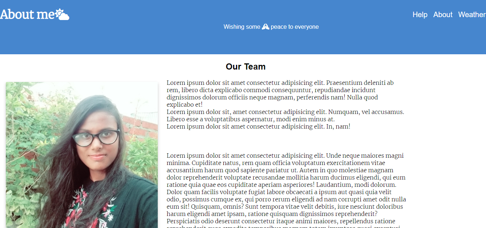

# WeatherAPP
It is a live application WeatherAPP made by using node.js and APIs.
You can also access the app via Heroku url which is provided below :- 

## How to run on the terminal

- install the npm modules

install express and hbs(handlebars) modules

- ### installing express module
```terminal
npm i express
```

- ### installing hbs module

```terminal
npm i hbs
```


now go to the terminal and go to the current directory i.e,

```terminal
PS C:\Users\USERNAME\WeatherAPP> cd web-servers
```
The above address may change according the folder you used to save the document. but the main code is only "cd web-servers" as it is the name of the folder that store the file

then run the code below to get to the right file to run in the servers
```
PS C:\Users\USERNAME\WeatherAPP\web-servers> node src/app.js
```

after the your terminal will show a line :- 
```
serving is up on the port 3000
````

## After the set up done in the terminal open your browser (most preferable :- google or Brave)
enter :-
```
localhost:3000
```

a page will pop up such like this below:-


search the place where you want to search the weather. 

the other parts of this project is a about page and a help page though they are static and have some dummy text in it only.

## About page


## Help page

peace to everyone :pray:
